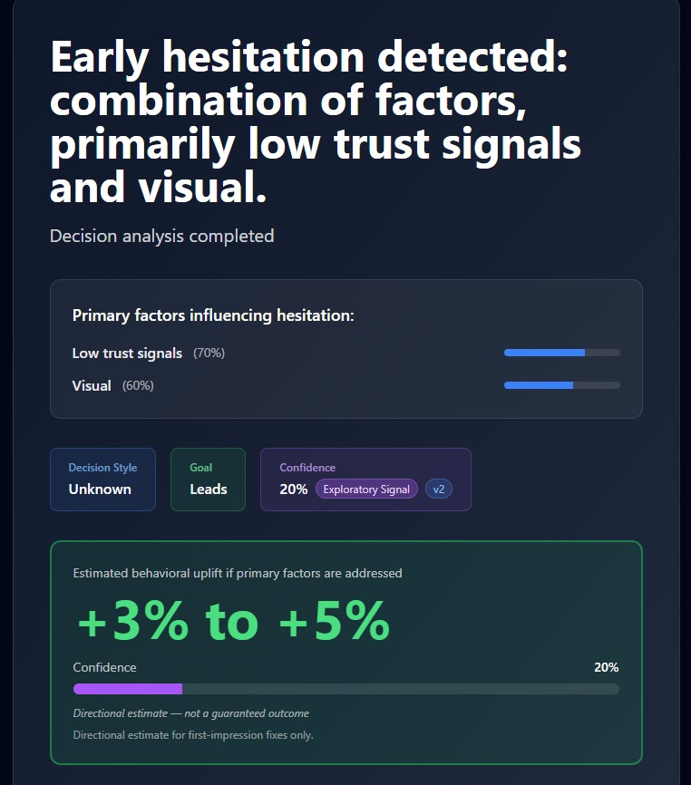
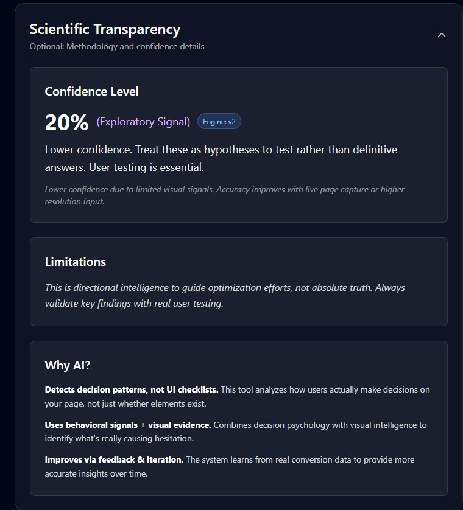
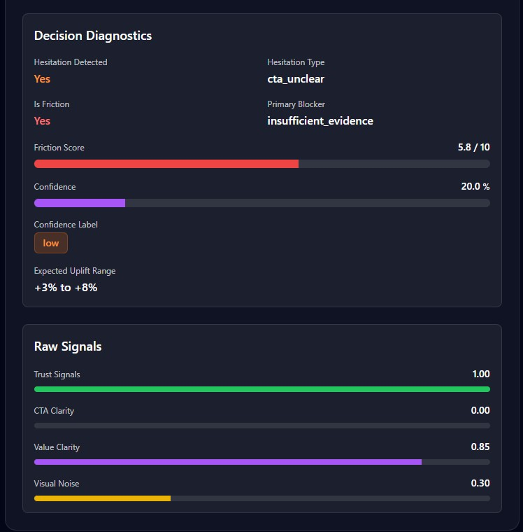
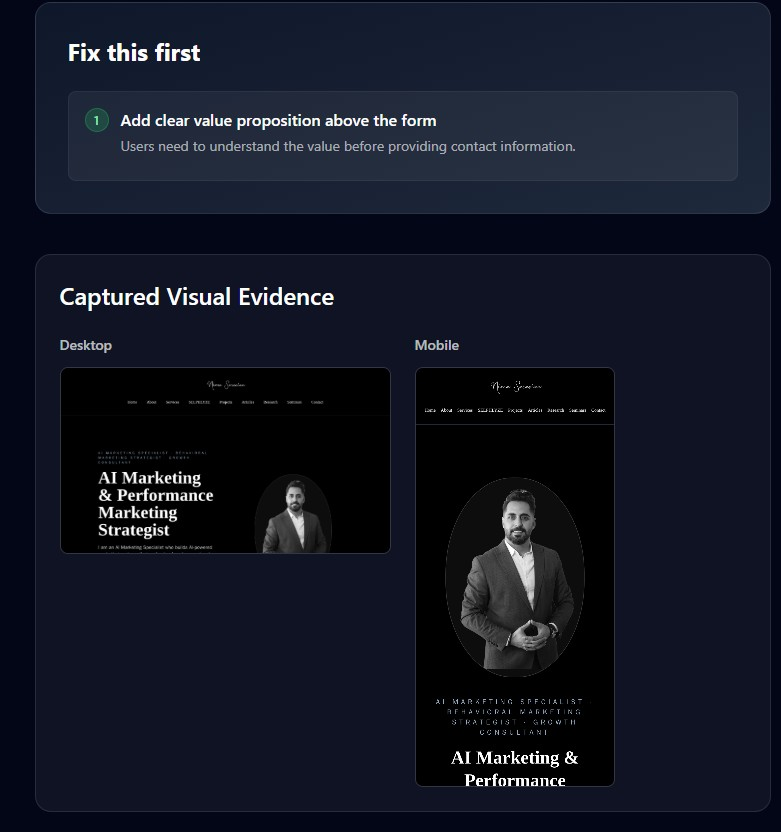

# AI Marketing Intelligence Demo

An AI-powered marketing intelligence system designed to analyze landing pages, detect behavioral friction, evaluate trust signals, and generate actionable optimization insights.

This repository is a **sanitized portfolio version** of a larger real-world AI marketing system. It demonstrates the architecture, analysis pipeline, and example outputs without exposing proprietary algorithms, private data, or production infrastructure.

---

# Overview

Modern marketing optimization often relies on superficial UI checklists or A/B testing without understanding **how users actually make decisions**.

This system introduces a **behavioral intelligence layer** that analyzes:

- user hesitation signals
- trust perception indicators
- CTA clarity
- visual friction
- decision confidence

The goal is to help marketers understand **why conversions fail before running experiments.**

---

# Key Capabilities

### Behavioral Friction Detection
Identifies signals indicating hesitation, confusion, or trust issues during the decision process.

### Trust Signal Evaluation
Analyzes credibility elements such as structure, messaging clarity, and visual cues.

### Decision Diagnostics
Provides interpretable insights about why users hesitate to convert.

### Optimization Guidance
Suggests prioritized improvements to reduce friction and increase conversion probability.

### Scientific Transparency
Includes confidence scoring and methodological transparency to prevent over-interpretation of AI outputs.

---

# Example Analysis Interface

Below are example outputs generated by the system.

### Landing Page Interface



---

### Decision Diagnostics


---

### Scientific Transparency



---

### Optimization Recommendation



---

### Behavioral Analysis Summary



---

# Example Output Structure

The system generates structured diagnostic outputs.

Example:

```json
{
  "hesitation_detected": true,
  "hesitation_type": "cta_unclear",
  "primary_blocker": "insufficient_evidence",
  "friction_score": 5.8,
  "confidence": 0.20,
  "recommended_fix": "Add clear value proposition above the form"
}
